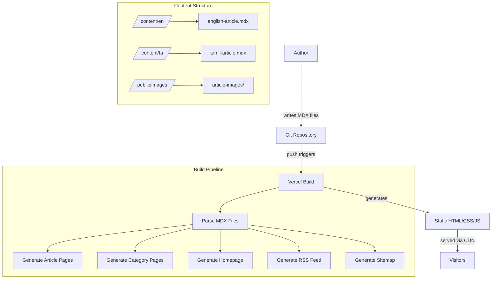
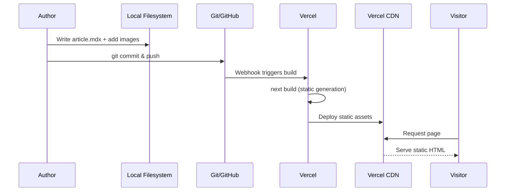
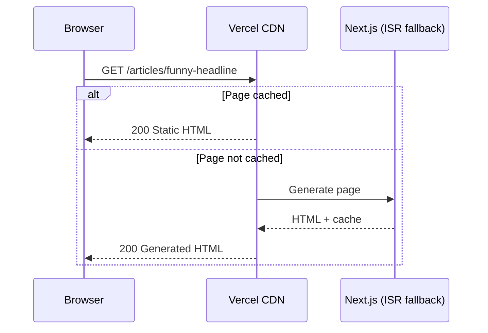

# Design Document: Satirical News Website

## Overview

A satirical news website (in the style of "The Onion") built with Next.js and Markdown/MDX for content authoring. The site presents satirical articles with a professional news aesthetic — clean typography, structured layouts, category navigation, and social sharing. Articles are authored as MDX files in a Git repository and deployed statically via Vercel for zero hosting cost and fast performance.

The single author writes articles locally in Markdown with frontmatter metadata, commits them, and pushes to trigger a rebuild. The site supports categories (e.g., "Politics", "Tech", "Local"), image embedding, social media share buttons, and SEO optimization to look and behave like a legitimate news outlet.

The site publishes articles in two languages — **Tamil** and **English** — as independent writeups (not translations of each other). Each language has its own section and content, with a language switcher in the navigation. Tamil articles use Tamil typography optimized for readability.

Target domain: vengayam.in

## Architecture



## Sequence Diagrams

### Article Publishing Flow



### Page Request Flow



## Components and Interfaces

### Component 1: Content Layer

**Purpose**: Parse MDX files, extract frontmatter, and provide typed article data to the application.

```typescript
interface Article {
  slug: string;
  title: string;
  subtitle?: string;
  author: string;
  publishedAt: string; // ISO 8601
  updatedAt?: string;
  language: Language;
  category: Category;
  tags: string[];
  excerpt: string;
  coverImage: string;
  coverImageAlt: string;
  featured: boolean;
  content: MDXContent;
}

type Language = "en" | "ta";

type Category = "politics" | "tech" | "local" | "world" | "entertainment" | "science" | "opinion";

interface ArticleMeta {
  slug: string;
  title: string;
  subtitle?: string;
  author: string;
  publishedAt: string;
  language: Language;
  category: Category;
  excerpt: string;
  coverImage: string;
  featured: boolean;
}
```

**Responsibilities**:
- Parse MDX frontmatter into typed `Article` objects
- Provide listing functions (all articles, by category, featured)
- Sort articles by publish date
- Validate frontmatter fields at build time

### Component 2: Page Layout System

**Purpose**: Provide the professional news website look and feel with responsive layouts and bilingual support.

```typescript
interface LayoutProps {
  children: React.ReactNode;
  metadata?: PageMetadata;
  language: Language;
}

interface PageMetadata {
  title: string;
  description: string;
  ogImage?: string;
  ogType?: "article" | "website";
  publishedTime?: string;
  category?: string;
  language: Language;
}

interface NavigationItem {
  label: string;
  labelTamil?: string;
  href: string;
  category?: Category;
}

interface LanguageSwitcherProps {
  currentLanguage: Language;
  currentPath: string;
}
```

**Responsibilities**:
- Site-wide header with navigation, category links, and language switcher
- Footer with site info
- Responsive grid layouts for article listings
- SEO meta tags and Open Graph data with `hreflang` tags
- Tamil typography with appropriate font stack (Noto Sans Tamil or similar)
- RTL-safe layout (Tamil is LTR but needs different font metrics)

### Component 3: Article Renderer

**Purpose**: Render MDX content with custom components styled for a news site.

```typescript
interface MDXComponents {
  h1: React.FC<HTMLAttributes<HTMLHeadingElement>>;
  h2: React.FC<HTMLAttributes<HTMLHeadingElement>>;
  p: React.FC<HTMLAttributes<HTMLParagraphElement>>;
  blockquote: React.FC<HTMLAttributes<HTMLQuoteElement>>;
  img: React.FC<ImageProps>;
  PullQuote: React.FC<{ quote: string; attribution?: string }>;
  RelatedArticle: React.FC<{ slug: string }>;
}
```

**Responsibilities**:
- Render article body with newspaper-style typography
- Support custom MDX components (pull quotes, image captions)
- Handle responsive images with Next.js Image optimization
- Display article metadata (date, category, author)

### Component 4: Social Sharing

**Purpose**: Provide share buttons for Twitter/X, Facebook, LinkedIn, and copy-link.

```typescript
interface ShareButtonsProps {
  url: string;
  title: string;
  description?: string;
}
```

**Responsibilities**:
- Generate platform-specific share URLs
- Copy-to-clipboard functionality
- Accessible button labels

## Data Models

### Article Frontmatter Schema

```typescript
// Validated at build time
interface ArticleFrontmatter {
  title: string;          // Required, max 120 chars
  subtitle?: string;      // Optional, max 200 chars
  author: string;         // Required, defaults to site author
  publishedAt: string;    // Required, ISO 8601 date
  updatedAt?: string;     // Optional, ISO 8601 date
  language: Language;     // Required, "en" or "ta" — inferred from content directory
  category: Category;     // Required, must be valid category
  tags: string[];         // Optional, for future filtering
  excerpt: string;        // Required, max 300 chars, used in listings & SEO
  coverImage: string;     // Required, path relative to /public
  coverImageAlt: string;  // Required, accessibility
  featured: boolean;      // Default false, shows on homepage hero
}
```

**Validation Rules**:
- `title` must be non-empty, max 120 characters
- `publishedAt` must be valid ISO 8601 date, not in the future
- `category` must be one of the defined categories
- `language` must be "en" or "ta" (can also be inferred from file path)
- `coverImage` file must exist in `/public/images/`
- `excerpt` must be non-empty, max 300 characters
- `coverImageAlt` must be non-empty (accessibility requirement)

### Site Configuration

```typescript
interface SiteConfig {
  name: string;              // "Vengayam" or chosen site name
  description: string;       // Site tagline/description
  descriptionTamil: string;  // Tamil tagline
  url: string;               // "https://vengayam.in"
  author: string;            // Default author name
  defaultLanguage: Language;  // "en" or "ta"
  supportedLanguages: Language[];  // ["en", "ta"]
  categories: CategoryConfig[];
  socialLinks: SocialLink[];
  navigation: NavigationItem[];
}

interface CategoryConfig {
  slug: Category;
  label: string;
  labelTamil: string;
  description: string;
  color: string;  // For UI accent
}

interface SocialLink {
  platform: string;
  url: string;
}
```

## Algorithmic Pseudocode

### Article Loading Algorithm

```typescript
/**
 * ALGORITHM: loadAllArticles
 * INPUT: language ("en" | "ta"), optional content directory override
 * OUTPUT: sorted array of ArticleMeta for that language
 *
 * Preconditions:
 *   - contentDir/{language}/ exists and contains .mdx files
 *   - Each .mdx file has valid frontmatter
 *
 * Postconditions:
 *   - Returns all articles for the specified language sorted by publishedAt descending
 *   - Only articles with publishedAt <= now() are included
 *   - Each article has a valid slug derived from filename
 *   - All returned articles have language === specified language
 */
async function loadAllArticles(language: Language, contentDir: string = CONTENT_DIR): Promise<ArticleMeta[]> {
  const langDir = path.join(contentDir, language);
  const files = await readDirectory(langDir, "**/*.mdx");
  const articles: ArticleMeta[] = [];

  for (const file of files) {
    const raw = await readFile(file);
    const { frontmatter } = parseMDX(raw);
    const slug = extractSlug(file); // filename without extension

    // INVARIANT: all processed articles have valid frontmatter
    validate(frontmatter);

    if (new Date(frontmatter.publishedAt) <= new Date()) {
      articles.push({ ...frontmatter, slug, language });
    }
  }

  // Sort newest first
  return articles.sort(
    (a, b) => new Date(b.publishedAt).getTime() - new Date(a.publishedAt).getTime()
  );
}
```

### Static Path Generation Algorithm

```typescript
/**
 * ALGORITHM: generateStaticPaths
 * INPUT: language
 * OUTPUT: array of path params for Next.js static generation
 *
 * Preconditions:
 *   - Content directory is accessible at build time
 *   - Language directory exists
 *
 * Postconditions:
 *   - Every published .mdx file in the language dir has a corresponding path
 *   - Slugs are URL-safe strings
 *   - Paths include language prefix (e.g., /en/articles/slug, /ta/articles/slug)
 */
async function generateStaticPaths(language: Language): Promise<{ params: { lang: string; slug: string } }[]> {
  const articles = await loadAllArticles(language);
  return articles.map((article) => ({
    params: { lang: language, slug: article.slug },
  }));
}
```

### Category Filtering Algorithm

```typescript
/**
 * ALGORITHM: getArticlesByCategory
 * INPUT: category slug, language
 * OUTPUT: articles filtered by category and language, sorted by date
 *
 * Preconditions:
 *   - category is a valid Category type
 *   - language is "en" or "ta"
 *
 * Postconditions:
 *   - All returned articles belong to the specified category AND language
 *   - Articles are sorted by publishedAt descending
 *   - Returns empty array if no articles match
 */
async function getArticlesByCategory(category: Category, language: Language): Promise<ArticleMeta[]> {
  const allArticles = await loadAllArticles(language);
  return allArticles.filter((article) => article.category === category);
}
```

## Key Functions with Formal Specifications

### Function: parseFrontmatter()

```typescript
function parseFrontmatter(raw: string): ArticleFrontmatter
```

**Preconditions:**
- `raw` is non-empty string
- `raw` begins with `---` YAML frontmatter delimiter

**Postconditions:**
- Returns valid `ArticleFrontmatter` object
- Throws `ValidationError` if required fields missing
- Throws `ValidationError` if field constraints violated
- No side effects

### Function: generateShareUrl()

```typescript
function generateShareUrl(platform: "twitter" | "facebook" | "linkedin", articleUrl: string, title: string): string
```

**Preconditions:**
- `platform` is one of the supported platforms
- `articleUrl` is a valid absolute URL
- `title` is non-empty

**Postconditions:**
- Returns a valid URL string for the platform's share dialog
- URL-encodes the article URL and title
- No side effects

### Function: getRelatedArticles()

```typescript
function getRelatedArticles(currentSlug: string, category: Category, language: Language, limit: number): Promise<ArticleMeta[]>
```

**Preconditions:**
- `currentSlug` is a valid article slug
- `category` is a valid Category
- `language` is "en" or "ta"
- `limit` > 0

**Postconditions:**
- Returns at most `limit` articles
- Does NOT include the article with `currentSlug`
- All returned articles are in the same `category` AND same `language`
- Sorted by `publishedAt` descending

**Loop Invariants:** N/A (filter + slice operation)

## Example Usage

### Writing an English Article (content/en/local-man-discovers-wifi-off.mdx)

```mdx
---
title: "Local Man Discovers WiFi Has Been Off For Three Years"
subtitle: "Neighbors report he seemed happier"
author: "Staff Writer"
publishedAt: "2024-01-15"
category: "local"
tags: ["technology", "local-news"]
excerpt: "A local resident made the shocking discovery after wondering why his Netflix recommendations never changed."
coverImage: "/images/articles/wifi-man.jpg"
coverImageAlt: "Man staring at router with confused expression"
featured: true
---

**CHENNAI** — In what experts are calling "genuinely impressive," local resident
Ravi Kumar, 34, discovered this Tuesday that his home WiFi router had been
unplugged since 2021.

"I just thought the internet was getting slower everywhere," Kumar told
reporters, gesturing vaguely at his phone. "I was using mobile data the
whole time."

<PullQuote quote="I saved ₹36,000 in broadband fees without even knowing it" attribution="Ravi Kumar" />

Neighbors report that Kumar seemed noticeably more productive during the
outage period, having read 47 books and learned conversational French.
```

### Writing a Tamil Article (content/ta/auto-driver-philosophy.mdx)

```mdx
---
title: "ஆட்டோ டிரைவர் தத்துவ ஆலோசனையால் பயணி மனநிலை மாற்றம்"
subtitle: "பயணக் கட்டணத்தை விட ஆலோசனைக் கட்டணம் அதிகம் என பயணி புகார்"
author: "நிருபர்"
publishedAt: "2024-01-16"
category: "local"
tags: ["auto", "philosophy"]
excerpt: "சென்னை ஆட்டோ டிரைவர் ஒருவர் பயணிகளுக்கு வாழ்க்கை ஆலோசனை வழங்குவதாக புகார்."
coverImage: "/images/articles/auto-philosophy.jpg"
coverImageAlt: "ஆட்டோ டிரைவர் பேசுகிறார்"
featured: true
---

**சென்னை** — தி.நகர் பகுதியில் இயங்கும் ஆட்டோ டிரைவர் செல்வம் (48)
பயணிகளுக்கு கேளாத வாழ்க்கை ஆலோசனைகளை வழங்குவதாக புகார்கள்
எழுந்துள்ளன.

<PullQuote quote="நான் மீட்டர் போடுவது மாதிரிதான், ஆலோசனையும் தானாக ஓடிக்கிட்டே இருக்கும்" attribution="செல்வம், ஆட்டோ டிரைவர்" />
```

### URL Structure

```
vengayam.in/                    → Language selector / default homepage
vengayam.in/en/                 → English homepage
vengayam.in/ta/                 → Tamil homepage
vengayam.in/en/articles/slug    → English article
vengayam.in/ta/articles/slug    → Tamil article
vengayam.in/en/category/local   → English category page
vengayam.in/ta/category/local   → Tamil category page
```

### Project File Structure

```
satirical-news-website/
├── content/
│   ├── en/                     # English articles
│   │   ├── local-man-discovers-wifi-off.mdx
│   │   └── ...
│   └── ta/                     # Tamil articles
│       ├── auto-driver-philosophy.mdx
│       └── ...
├── public/
│   └── images/
│       ├── articles/
│       └── site/
├── src/
│   ├── app/
│   │   ├── layout.tsx          # Root layout with header/footer
│   │   ├── page.tsx            # Homepage (language selector or default)
│   │   └── [lang]/
│   │       ├── layout.tsx      # Language-specific layout (font, dir)
│   │       ├── page.tsx        # Language homepage
│   │       ├── articles/
│   │       │   └── [slug]/
│   │       │       └── page.tsx    # Article page
│   │       └── category/
│   │           └── [category]/
│   │               └── page.tsx    # Category listing
│   ├── components/
│   │   ├── Header.tsx
│   │   ├── Footer.tsx
│   │   ├── LanguageSwitcher.tsx
│   │   ├── ArticleCard.tsx
│   │   ├── ArticleGrid.tsx
│   │   ├── FeaturedArticle.tsx
│   │   ├── ShareButtons.tsx
│   │   ├── CategoryBadge.tsx
│   │   └── mdx/
│   │       ├── PullQuote.tsx
│   │       └── index.tsx       # MDX component registry
│   ├── lib/
│   │   ├── articles.ts         # Content loading & parsing
│   │   ├── config.ts           # Site configuration
│   │   ├── i18n.ts             # UI string translations (nav, labels)
│   │   └── utils.ts            # Shared utilities
│   └── styles/
│       └── globals.css         # Tailwind + custom news typography + Tamil fonts
├── next.config.js
├── tailwind.config.ts
├── package.json
└── tsconfig.json
```

## Correctness Properties

```typescript
// Property 1: All published articles have valid dates
// ∀ article ∈ publishedArticles: isValidDate(article.publishedAt) ∧ article.publishedAt <= now()

// Property 2: Article slugs are unique within a language
// ∀ lang ∈ Languages: ∀ a, b ∈ articles(lang): a.slug === b.slug ⟹ a === b

// Property 3: Category filtering is exhaustive
// ∀ category ∈ Categories, lang ∈ Languages:
//   getArticlesByCategory(category, lang).every(a => a.category === category ∧ a.language === lang)

// Property 4: Featured articles appear on language homepage
// ∀ lang ∈ Languages: ∀ article ∈ articles(lang):
//   article.featured === true ⟹ article ∈ homepageHero(lang)

// Property 5: Share URLs are valid
// ∀ platform ∈ ["twitter", "facebook", "linkedin"]:
//   isValidUrl(generateShareUrl(platform, validUrl, validTitle))

// Property 6: Articles are sorted by date (newest first) within each language
// ∀ lang ∈ Languages: ∀ i ∈ [0, articles(lang).length - 1):
//   articles(lang)[i].publishedAt >= articles(lang)[i+1].publishedAt

// Property 7: No future-dated articles appear in listings
// ∀ lang ∈ Languages: ∀ article ∈ getVisibleArticles(lang): article.publishedAt <= now()

// Property 8: Cover images have alt text (accessibility)
// ∀ article ∈ allArticles: article.coverImageAlt.length > 0

// Property 9: Language isolation — articles only appear in their language section
// ∀ article ∈ loadAllArticles("en"): article.language === "en"
// ∀ article ∈ loadAllArticles("ta"): article.language === "ta"

// Property 10: URL structure includes language prefix
// ∀ article ∈ allArticles: articleUrl(article) starts with /{article.language}/
```

## Error Handling

### Error Scenario 1: Invalid Frontmatter

**Condition**: MDX file has missing or malformed frontmatter fields
**Response**: Build fails with descriptive error showing filename and missing/invalid fields
**Recovery**: Author fixes the frontmatter and pushes again

### Error Scenario 2: Missing Cover Image

**Condition**: Frontmatter references an image path that doesn't exist in `/public`
**Response**: Build-time warning; fallback to a default placeholder image
**Recovery**: Author adds the image or fixes the path

### Error Scenario 3: Duplicate Slugs

**Condition**: Two MDX files produce the same slug
**Response**: Build fails with error identifying the conflicting files
**Recovery**: Author renames one of the files

### Error Scenario 4: Future-Dated Article

**Condition**: Article has `publishedAt` in the future
**Response**: Article is excluded from listings and sitemaps (acts as scheduling)
**Recovery**: Article automatically appears when date arrives on next rebuild

## Testing Strategy

### Unit Testing Approach

- Test frontmatter parsing and validation with valid/invalid inputs
- Test slug generation from filenames
- Test date sorting logic
- Test category filtering
- Test share URL generation
- Framework: Vitest (fast, Next.js-compatible)

### Property-Based Testing Approach

**Property Test Library**: fast-check

- Generate random frontmatter objects to test validation boundaries
- Generate random article collections to verify sorting invariants
- Generate random slugs to test URL-safety constraints

### Integration Testing Approach

- Test full MDX rendering pipeline (frontmatter → HTML)
- Test Next.js static generation with sample articles
- Visual regression tests for key layouts (optional, future)

## Performance Considerations

- **Static Generation**: All pages pre-rendered at build time — no server compute per request
- **Image Optimization**: Next.js `<Image>` component for automatic WebP/AVIF conversion, lazy loading, and responsive srcsets
- **CDN**: Vercel's edge CDN serves assets globally with minimal latency
- **Bundle Size**: Minimal JavaScript — mostly static HTML with progressive enhancement
- **Font Loading**: Use `next/font` for optimized self-hosted fonts — English (serif like Playfair Display or Lora) and Tamil (Noto Sans Tamil or Catamaran). Use font subsetting to minimize Tamil font file sizes
- **Language Splitting**: Each language section only loads its own articles at build time — no cross-language overhead

## Security Considerations

- **No Database**: Static site with no user input — minimal attack surface
- **No Authentication**: Single author publishes via Git (secured by Git provider)
- **Content Security Policy**: Set CSP headers via `next.config.js` to prevent XSS
- **Image Sources**: Restrict `next/image` domains to own domain only
- **No Third-Party Scripts**: Avoid analytics/ads scripts that could introduce vulnerabilities

## Dependencies

| Package | Purpose |
|---------|---------|
| next | React framework with static generation |
| react / react-dom | UI library |
| @next/mdx or next-mdx-remote | MDX parsing and rendering |
| gray-matter | Frontmatter parsing |
| tailwindcss | Utility-first CSS framework |
| @tailwindcss/typography | Prose styling for article content |
| date-fns | Date formatting |
| fast-check | Property-based testing |
| vitest | Unit test runner |
